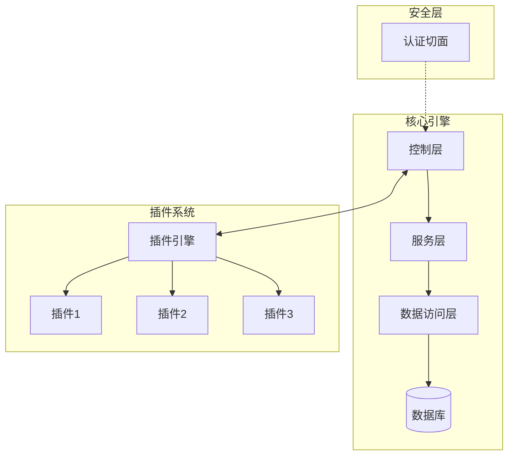
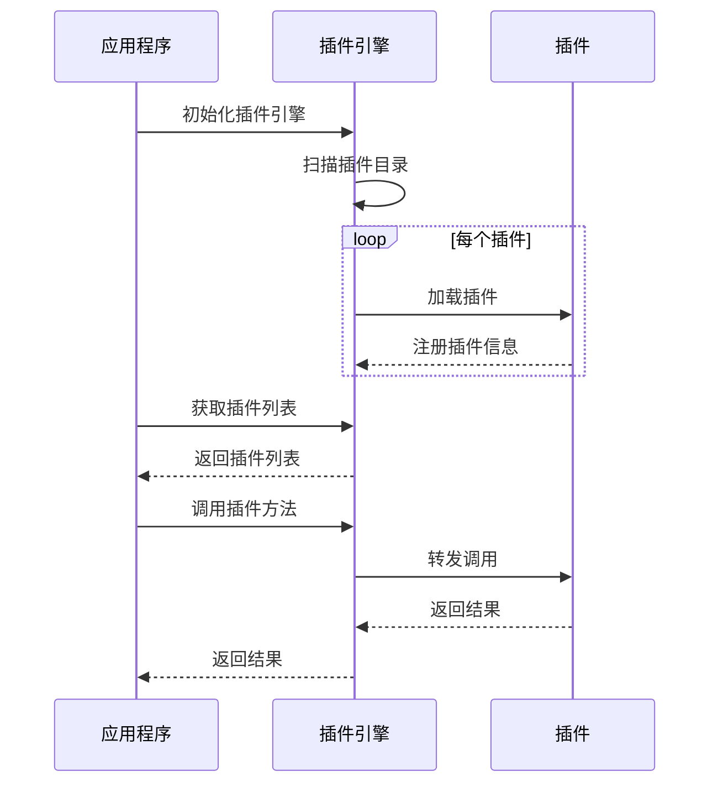
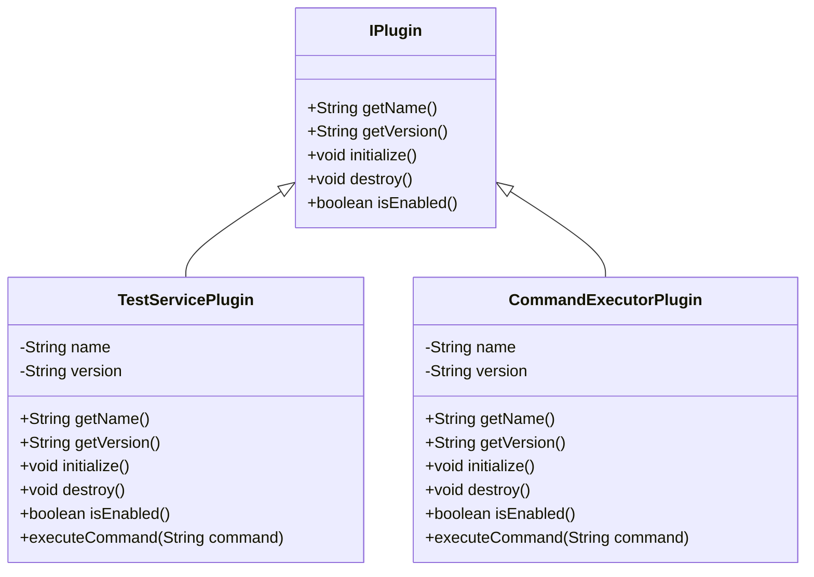
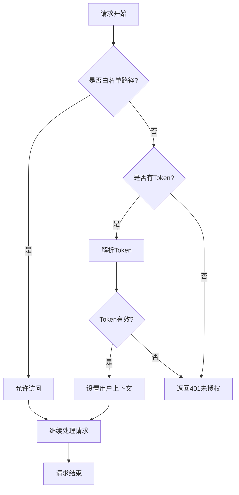
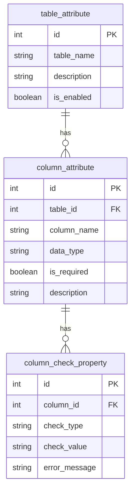
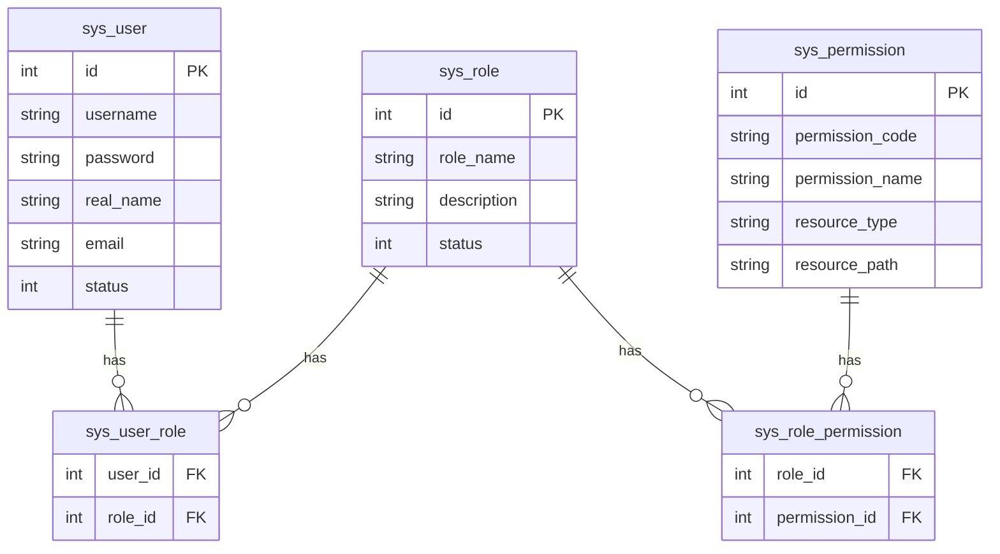
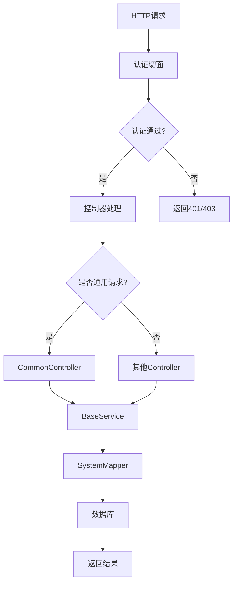
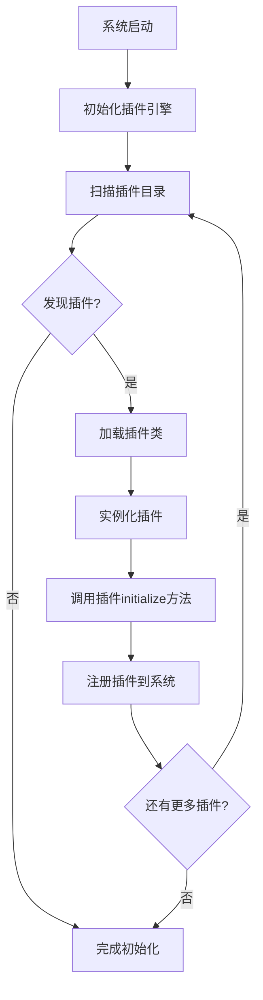

# 系统架构文档

## 1. 系统概述

动态插件框架是一个基于Java Spring Boot的可扩展系统，通过插件化架构实现业务功能的动态加载和卸载。系统遵循"数据驱动一切"和"配置优于编码"的核心理念，大部分业务逻辑通过数据库配置实现，而非硬编码。

## 2. 系统架构

系统采用分层架构，主要包括以下几层：

1. **控制层（Controller）**：处理HTTP请求，进行权限验证和参数校验
2. **服务层（Service）**：实现业务逻辑，处理数据
3. **数据访问层（Mapper）**：与数据库交互，执行SQL语句
4. **插件层（Plugin）**：提供可动态加载卸载的业务功能扩展

### 2.1 系统架构图

## 3. 核心组件

### 3.1 核心引擎

核心引擎负责系统的基础功能，包括通用CRUD操作、权限验证、数据校验等。

#### 3.1.1 CommonController

提供通用的数据操作接口，包括查询、保存和删除功能。

#### 3.1.2 BaseService

提供基础的服务功能，包括数据库操作、缓存管理等。

#### 3.1.3 SystemMapper

提供系统级的数据库操作，包括配置表的读取、系统参数的获取等。

### 3.2 插件系统

插件系统负责管理和加载插件，实现业务功能的动态扩展。

#### 3.2.1 PluginEngine

负责插件的加载、卸载和生命周期管理。

#### 3.2.2 IPlugin接口

所有插件必须实现的接口，定义了插件的基本行为。

### 3.3 安全层

安全层负责系统的安全控制，包括认证、授权和数据权限控制。

#### 3.3.1 AuthenticationAspect

负责请求的认证和授权，验证用户身份和权限。

#### 3.3.2 UserContext

存储当前用户的上下文信息，包括用户ID、用户名、权限等。

## 4. 数据模型

系统的核心数据模型包括：

### 4.1 配置表

### 4.2 用户权限表

## 5. 关键流程

### 5.1 请求处理流程

### 5.2 插件加载流程

## 6. 设计决策

### 6.1 为什么选择插件化架构

插件化架构允许系统在不重启的情况下动态加载和卸载功能模块，提高了系统的灵活性和可扩展性。这种架构特别适合需要频繁添加新功能的系统。

### 6.2 为什么采用数据驱动

数据驱动设计将业务规则和配置存储在数据库中，而不是硬编码在代码中，这使得系统更加灵活，能够在不修改代码的情况下调整业务规则。

## 7. 注意事项和限制

1. 插件开发必须遵循IPlugin接口规范
2. 数据库配置修改需要谨慎，可能影响系统行为
3. 白名单路径必须从数据库获取，不允许硬编码
4. 用户信息必须通过UserContext获取，不允许从其他途径获取 