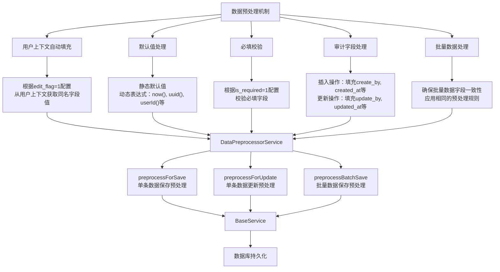

# 项目开发宪法与开发者指南

本指南是项目所有开发活动的最高准则。所有开发者，包括AI助手，都必须严格遵守本文档中定义的架构哲学、开发规范和协作流程。

## 核心哲学 ("The Constitution")

1. **数据驱动一切**: 这是我们最核心的原则。任何业务逻辑、校验规则、API行为，都必须优先通过查询配置表（如 `table_attribute`, `column_attribute`, `column_check_property`）来驱动。**在编写Java代码前，必须首先思考："这个功能能否通过修改数据库配置来实现？"**
2. **配置优于编码**: 如果一个功能可以通过增加一条数据库配置记录来完成，就绝不应该硬编码在Java代码中。
3. **插件化一切**: 任何独立的、大型的业务功能（如文件服务、AI服务），都必须实现为可独立加载、卸载的插件。插件应封装自己的Controller、Service，并通过 `IPlugin`接口与核心引擎交互。
4. **"三不三少"原则**:
   * **三不**: 不过度开发、不过度复杂、不破坏现有功能。
   * **三少**: 少文件、少代码、少调用。始终追求最简洁、最高效的实现。

## 架构设计

1. **双引擎架构**:
   - **数据引擎**: 由 `CommonService`, `BaseService`, `SystemMapper`及相关配置表构成，负责所有通用数据操作。
   - **插件引擎**: 由 `PluginEngine`, `IPlugin`接口及 `plugin_config`表构成，负责动态功能的生命周期管理。
2. **三层架构**: 严格遵守 **表现层(Controller)** -> **业务层(Service)** -> **数据访问层(Mapper)** 的分层结构。
3. **安全层**: `AuthenticationAspect`作为安全切面，对所有进入Controller的请求进行统一的JWT校验和用户上下文设置。

## 开发规范

### 命名规范

- **包名（package）**：全部小写，使用反转域名的层次结构。如：`com.ycbd.demo`。子包按功能或层级细分，不使用拼音。
- **类名（Class）**：使用 PascalCase，以名词或名词短语命名，如 `UserService`、`PluginEngine`。抽象类可加前缀 `Abstract`，如 `AbstractProcessor`。
- **接口（Interface）**：使用 PascalCase，必要时以功能+`Service`/`Repository` 结尾。若需突出接口特性，可使用 `I` 前缀，如 `IPlugin`。
- **方法名（Method）**：使用 camelCase，以动词开头，表达动作和意图，如 `saveUser()`、`buildQuery()`。
- **变量名（Variable）**：使用 camelCase，以名词或名词短语命名，避免缩写，如 `userName`、`queryRuleList`。
- **常量（Constant）**：使用 `UPPER_SNAKE_CASE`，需加 `static final` 修饰，如 `MAX_RETRY_COUNT`。
- **数据库表名**：使用 `snake_case`，尽量为复数形式，如 `user_accounts`。中间表使用 `xxx_relation` 或 `xxx_mapping`。
- **数据库字段名**：使用 `snake_case`，简洁明了，如 `created_at`、`user_id`。
- **XML/Mapper SQL 别名**：使用 `snake_case`，与字段名保持一致，避免歧义。
- **脚本与资源文件**：文件名使用 `kebab-case` 或 `snake_case`，表达内容含义，如 `run_all_tests.sh`、`application-test.properties`。
- **测试用例**：类名以被测类名 + `Test` 结尾，如 `PluginEngineTest`。方法名以 `should` 开头描述行为，如 `shouldLoadPluginSuccessfully()`。
- **枚举值**：使用 `UPPER_SNAKE_CASE`，如 `SUCCESS`, `FAILURE`。

> 遵循统一的命名规则可以显著提升代码可读性、可维护性，并降低团队协作成本。如遇特殊场景无法满足以上规则，应在代码注释中说明原因。

### API设计

- **RESTful风格**: 使用标准的HTTP方法 (GET, POST, PUT, DELETE)。
- **统一响应**: 所有Controller接口必须返回 `ApiResponse`对象，以确保前端接收到统一的 `{code, message, data}` 格式。
- **统一入口**: 通用CRUD操作应通过 `/api/common`下的接口进行。插件提供的功能性API应有自己的命名空间，如 `/api/plugins/upload`。

### 安全与认证

- **JWT认证**: 所有非白名单接口都必须在请求头中携带 `Authorization: Bearer <token>`。
- **用户信息获取**: 在业务逻辑中，**严禁**从前端参数获取用户信息。必须通过 `UserContext.getUserId()`或 `UserContext.getUserName()`从安全上下文中获取。
- **白名单配置**: API的访问白名单由 `security_config`表动态管理。

### 数据库交互

- **禁止裸写SQL**: 严禁在Java代码（尤其是Service层）中拼接SQL语句。
- **使用Mapper**: 所有数据库操作必须通过 `SystemMapper`接口及其对应的XML文件完成。
- **配置驱动**: 表的CRUD行为（如可编辑字段、列表显示字段、排序规则）由 `table_attribute`和 `column_attribute`表定义。
- **校验规则**: 数据的业务校验逻辑由 `column_check_property`表定义，并通过 `ValidationService`统一执行。

### 插件开发

1. **创建主类**: 实现 `IPlugin`接口。
2. **封装组件**: 将插件所需的Controller、Service等组件放在独立的包内，且**不能**有 `@Service`, `@RestController`等Spring启动时注解。
3. **生命周期管理**:
   - 在 `initialize()`方法中，使用 `BeanDefinitionRegistry`动态注册插件内部的Bean，并刷新 `RequestMappingHandlerMapping`以激活Controller。
   - 在 `shutdown()`方法中，执行相反的操作，注销Bean并清理资源。
4. **依赖核心服务**: 插件可以通过 `@Autowired`注入核心平台提供的任何Bean（如 `CommonService`, `BaseService`）。依赖由 `PluginEngine`在加载时自动注入。
5. **打包与部署**: 将编译后的所有 `.class`文件（保持包结构）放入服务器的 `plugins/`目录下。

### 异常处理

- **向上抛出**: 业务逻辑中的异常应直接向上抛出，或包装为自定义的业务异常。
- **全局捕获**: `GlobalExceptionHandler`会捕获所有未处理的异常，并返回统一的错误响应格式。

## 通用字典表 `sys_dictionary`

| 字段                    | 说明          | 示例               |
| ----------------------- | ------------- | ------------------ |
| id                      | 主键          | 1                  |
| dict_name               | 字典名称/类型 | camera_model_dict  |
| keyword                 | 关键字        | IMG_ / DCIM        |
| category                | 标签/值       | Apple / Canon      |
| extra                   | JSON 扩展     | {"model":"iPhone"} |
| created_at / updated_at | 时间戳        |                    |

使用规范：

1. **新增或维护** 通过 `/api/common/save` 接口写入，遵守同一个 dict 下 `keyword` 唯一性。
2. **查询** 使用 `dict_name` + `keyword` 过滤。
3. **字典驱动**：
   - `DescriptionBasedClassifier` 读取 `image_keyword_map` 进行描述分类。
   - `MetadataProcessor` 读取 `camera_model_dict`、`metadata_field_dict` 做品牌解析和 EXIF 映射。
4. 后续如需多租户扩展，添加 `owner_type/owner_id` 字段并依优先级查询。

## 数据过滤自动填充机制

### 概述

系统实现了基于用户上下文的数据过滤自动填充机制。当查询数据时，系统会自动根据配置将用户上下文中的信息填充到查询条件中，实现数据权限控制和行级过滤。

### 工作原理

1. 在 `column_attribute`表中，`search_flag=1`标记具有双重作用：

   - **可过滤标识**：只有 `search_flag=1`的字段才会被纳入查询条件，即使客户端传入了其他字段参数
   - **自动填充候选**：当请求参数中缺少这些字段时，系统会尝试从用户上下文中获取同名字段值进行填充
2. 查询过滤流程：

   - 系统首先获取表的所有 `search_flag=1`的字段列表
   - 对于每个标记字段，检查请求参数中是否已包含该字段
   - 如果请求参数已包含该字段，则使用请求参数中的值（显式参数优先）
   - 如果请求参数中不包含该字段，则尝试从用户上下文中获取同名字段的值
   - 如果用户上下文中存在同名字段且值不为空，则将该值添加到查询条件中
   - 如果字段既不在请求参数中，也不在用户上下文中，则不添加该字段的过滤条件
3. **重要说明**：不属于 `search_flag=1`的字段，即使在请求参数中提供了值，也不会被用作过滤条件。这是一种安全机制，确保只有经过授权的字段才能用于数据过滤。

### 开发规范

在设计新的数据表和业务功能时，请遵循以下规范：

1. **字段命名一致性**：如需实现自动过滤，请确保数据表中的字段名与 `UserContext`中的字段名保持一致

   - 例如：用户ID字段统一命名为 `user_id`，组织ID字段统一命名为 `org_id`等
2. **配置而非硬编码**：

   - 在 `column_attribute`表中设置 `search_flag=1`来标记可用于过滤的字段
   - 通过 `query_type`字段配置匹配方式（eq、like、in、range等）
3. **优先级规则**：

   - 显式传入的参数优先级高于自动填充
   - 如果请求参数中已包含某字段，系统不会覆盖该值

### 示例配置与行为说明

为表 `sys_log`配置字段过滤：

```sql
INSERT INTO column_attribute 
(db_table_name, column_name, page_name, search_flag, query_type) 
VALUES 
('sys_log', 'user_id', '用户ID', 1, 'eq'),
('sys_log', 'log_type', '日志类型', 1, 'eq'),
('sys_log', 'content', '日志内容', 1, 'like'),
('sys_log', 'ip_address', 'IP地址', 0, 'eq');
```

**场景分析**：

1. **场景一**：请求参数中包含 `user_id=1`和 `ip_address=192.168.1.1`

   - 结果：只有 `user_id=1`会被用作过滤条件
   - 原因：`ip_address`的 `search_flag=0`，不被允许用作过滤条件
2. **场景二**：请求参数中只包含 `log_type=ERROR`，当前用户ID为2

   - 结果：过滤条件为 `log_type=ERROR AND user_id=2`
   - 原因：`log_type`来自请求参数，`user_id`自动从用户上下文填充
3. **场景三**：请求参数为空，当前用户ID为3，用户上下文中包含 `content='登录'`

   - 结果：过滤条件为 `user_id=3 AND content LIKE '%登录%'`
   - 原因：两个字段都从用户上下文自动填充，且 `content`使用LIKE查询

### 注意事项

1. 确保 `UserContext`中包含所需的用户信息字段
2. 在设计新表时，仔细考虑哪些字段应该设置 `search_flag=1`：
   - 设置过多会导致过度过滤，可能影响查询结果的全面性
   - 设置过少可能导致数据权限控制不足
3. 测试时应验证：
   - 非 `search_flag=1`的字段确实不会被用于过滤
   - 自动填充功能在各种场景下正常工作
4. `search_flag`是查询安全的重要保障，请谨慎配置

## 系统架构

本系统采用插件化架构，核心引擎提供基础功能，各业务模块以插件形式加载。


## 项目的完整目录结构：

```
dpf-demo
├── docs
│   ├── api
│   │   └── common-controller.md
│   ├── dev
│   │   ├── architecture.md
│   │   ├── operation-log.md
│   │   ├── 开发文档.md
│   │   └── 数据预处理机制.md
│   ├── plugins
│   │   ├── command-executor-plugin.md
│   │   └── test-service.md
│   ├── test
│   │   ├── data-preprocessor-test.md
│   │   └── filter-auto-fill-test.md
│   ├── test-plan.md
│   ├── user
│   │   ├── getting-started.md
│   │   └── test-service-usage.md
│   ├── 测试规范.md
│   └── 文档规范.md
├── logs
├── plugins
├── pom.xml
├── README.md
├── src
│   ├── main
│   │   ├── java
│   │   │   └── com
│   │   │       └── ycbd
│   │   │           └── demo
│   │   │               ├── aspect
│   │   │               │   └── AuthenticationAspect.java
│   │   │               ├── config
│   │   │               │   ├── AppProperties.java
│   │   │               │   └── RestTemplateConfig.java
│   │   │               ├── controller
│   │   │               │   ├── CommonController.java
│   │   │               │   ├── CoreController.java
│   │   │               │   ├── LegacyPluginController.java
│   │   │               │   ├── PluginController.java
│   │   │               │   └── TestController.java
│   │   │               ├── DemoApplication.java
│   │   │               ├── exception
│   │   │               │   └── GlobalExceptionHandler.java
│   │   │               ├── mapper
│   │   │               │   └── SystemMapper.java
│   │   │               ├── plugin
│   │   │               │   ├── commandexecutor
│   │   │               │   │   ├── CommandExecutionService.java
│   │   │               │   │   ├── CommandExecutorController.java
│   │   │               │   │   └── CommandExecutorPlugin.java
│   │   │               │   ├── IPlugin.java
│   │   │               │   ├── PluginEngine.java
│   │   │               │   └── TestServicePlugin.java
│   │   │               ├── security
│   │   │               │   └── UserContext.java
│   │   │               ├── service
│   │   │               │   ├── BaseService.java
│   │   │               │   ├── CommonService.java
│   │   │               │   ├── DataPreprocessorService.java
│   │   │               │   ├── FilterRuleService.java
│   │   │               │   ├── JwtService.java
│   │   │               │   ├── MetaService.java
│   │   │               │   ├── OperationLogService.java
│   │   │               │   ├── TableConfigInitializer.java
│   │   │               │   ├── TokenFieldConfigService.java
│   │   │               │   └── ValidationService.java
│   │   │               └── utils
│   │   │                   ├── ApiResponse.java
│   │   │                   ├── DateUtils.java
│   │   │                   ├── FileUtils.java
│   │   │                   ├── MapUtils.java
│   │   │                   ├── QueryRuleEnum.java
│   │   │                   ├── ResultCode.java
│   │   │                   ├── SqlWhereBuilder.java
│   │   │                   └── Tools.java
│   │   └── resources
│   │       ├── application.properties
│   │       ├── data.sql
│   │       ├── mapper
│   │       │   └── SystemMapper.xml
│   │       ├── schema.sql
│   │       └── test
│   │           ├── application-test.properties
│   │           ├── generate_test_script.sh
│   │           ├── runs
│   │           │   ├── capture_sql_log.sh
│   │           │   ├── logs
│   │           │   ├── run_all_tests.sh
│   │           │   ├── run_common_api_test.sh
│   │           │   ├── run_where_builder_test.sh
│   │           │   ├── start_test_env.sh
│   │           │   ├── test_where_builder.sh
│   │           │   └── user.sh
│   │           ├── test_command_executor.curl
│   │           ├── test_common_api.curl
│   │           ├── test_user_crud.curl
│   │           └── test_where_builder.curl


```

---

### 核心组件

1. **核心引擎**：负责插件生命周期管理、通用服务和基础设施
2. **插件管理器**：实现插件的动态加载、卸载和版本管理
3. **通用服务层**：提供数据访问、认证授权等基础服务
4. **配置中心**：集中管理系统配置和业务规则

### 数据处理机制

系统实现了一套完整的数据处理机制，包括：

1. **数据预处理机制**：在数据持久化前进行默认值填充、必填校验等处理
2. **过滤条件自动填充**：基于配置自动从用户上下文中获取过滤条件
3. **动态查询构建**：支持复杂查询条件的动态构建

## 数据预处理机制

### 概述

数据预处理机制（`DataPreprocessorService`）负责在数据持久化前对数据进行统一的预处理，包括默认值填充、必填校验、审计字段处理等。该机制通过配置驱动，遵循"数据驱动一切"和"配置优于编码"的核心理念，减少硬编码，提高系统灵活性和可维护性。

### 核心功能

1. **用户上下文自动填充**：根据列属性配置表中的 `edit_flag=1`标记，自动从用户上下文中获取同名字段值填充到数据中
2. **默认值处理**：根据列属性配置表中的 `default_value`配置，自动为空值字段填充默认值，支持静态值和动态表达式
3. **必填校验**：根据列属性配置表中的 `is_required=1`标记，自动校验必填字段
4. **审计字段处理**：自动处理标准审计字段（创建人、创建时间、更新人、更新时间等）
5. **批量数据处理**：支持批量数据的预处理，并确保批量数据的字段一致性

### 配置说明

数据预处理机制主要通过 `column_attribute`表进行配置：

| 字段名        | 说明                                   | 示例          |
| ------------- | -------------------------------------- | ------------- |
| db_table_name | 数据库表名                             | user_info     |
| column_name   | 列名                                   | user_id       |
| page_name     | 页面显示名称                           | 用户ID        |
| edit_flag     | 是否从用户上下文自动填充（1=是，0=否） | 1             |
| is_required   | 是否必填（1=是，0=否）                 | 1             |
| default_value | 默认值，支持静态值和动态表达式         | 1 或 userId() |

### 动态表达式支持

默认值支持以下动态表达式：

- `now()` - 当前时间戳
- `uuid()` - 生成UUID
- `userId()` - 当前用户ID
- `username()` - 当前用户名
- `orgId()` - 当前组织ID

### 使用方法

```java
// 单条数据保存预处理
Map<String, Object> data = new HashMap<>();
data.put("title", "测试标题");
dataPreprocessorService.preprocessForSave("table_name", data);
baseService.save("table_name", data);

// 单条数据更新预处理
Map<String, Object> data = new HashMap<>();
data.put("id", 1);
data.put("title", "更新的标题");
dataPreprocessorService.preprocessForUpdate("table_name", data);
baseService.update("table_name", data);

// 批量数据保存预处理
List<Map<String, Object>> dataList = new ArrayList<>();
// ... 添加数据 ...
dataList = dataPreprocessorService.preprocessBatchSave("table_name", dataList);
baseService.batchSave("table_name", dataList);
```

### 处理流程图



## 过滤条件自动填充机制

// ... 其他内容 ...

## 插件开发指南

// ... 其他内容 ...
