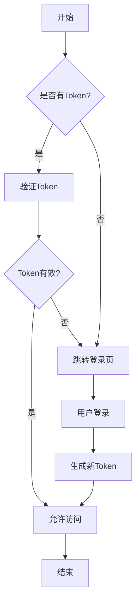

# 文档规范

## 1. 文档原则

根据系统核心哲学中的"文档同步更新"原则，所有代码变更都必须同步更新相关文档。本文档规定了项目中文档的编写和维护标准。

## 2. 文档类型

项目中包含以下几种文档类型：

### 2.1 接口文档

描述API接口的使用方法、参数、返回值等信息，供前端开发人员和第三方集成使用。

### 2.2 开发文档

描述系统架构、设计决策、核心组件等信息，供开发人员理解和维护系统。

### 2.3 使用说明

描述系统功能的使用方法，供最终用户使用。

### 2.4 规范文档

描述项目中的各种规范，如编码规范、测试规范等。

## 3. 文档组织

文档应按以下方式组织：

```
docs/                             # 文档根目录
├── api/                          # API接口文档
│   ├── common-controller.md      # 通用控制器接口文档
│   └── ...
├── dev/                          # 开发文档
│   ├── architecture.md           # 系统架构文档
│   └── ...
├── user/                         # 用户文档
│   ├── getting-started.md        # 入门指南
│   └── ...
├── 测试规范.md                    # 测试规范文档
├── 文档规范.md                    # 文档规范文档
└── ...
```

## 4. 文档编写规范

### 4.1 Markdown格式

所有文档应使用Markdown格式编写，遵循以下规范：

1. 使用 `#`表示一级标题，`##`表示二级标题，以此类推
2. 代码块使用三个反引号包裹，并指定语言类型
3. 使用 `-`或 `*`表示无序列表，使用数字表示有序列表
4. 使用 `>`表示引用
5. 使用 `[链接文本](链接地址)`表示链接
6. 使用 ``表示图片

### 4.2 流程图规范

所有流程图应使用Mermaid语法编写，遵循以下规范：

1. 流程图应使用Markdown中的Mermaid代码块表示
2. 节点和连线应有清晰的标识和说明
3. 复杂流程应分解为多个子流程图
4. 使用不同形状区分不同类型的节点（开始/结束、处理、判断等）
5. 流程方向应从上到下或从左到右，保持一致性

示例：

```markdown
## 用户认证流程



```

常用的流程图节点形状：

- `[方框]`: 处理步骤
- `(圆角方框)`: 开始/结束
- `{菱形}`: 判断/条件
- `>不对称形状]`: 特殊处理
- `[(数据库)]`: 数据存储

流程图类型：

1. **流程图(flowchart)**：用于表示一般业务流程
2. **时序图(sequenceDiagram)**：用于表示对象之间的交互顺序
3. **类图(classDiagram)**：用于表示类的结构和关系
4. **状态图(stateDiagram)**：用于表示状态转换
5. **甘特图(gantt)**：用于项目进度规划

### 4.3 接口文档规范

接口文档应包含以下内容：

1. 接口名称和描述
2. 请求方法（GET, POST, PUT, DELETE等）
3. 请求URL
4. 请求参数（包括参数名、类型、是否必须、描述）
5. 请求示例
6. 响应参数（包括参数名、类型、描述）
7. 响应示例
8. 错误码和错误信息

示例：

```markdown
# 用户登录接口

## 接口描述

用户登录接口，验证用户名和密码，返回JWT令牌。

## 请求方法

POST

## 请求URL

/api/core/login

## 请求参数

| 参数名   | 类型   | 必须 | 描述     |
|---------|--------|-----|---------|
| username | String | 是  | 用户名   |
| password | String | 是  | 密码     |

## 请求示例

```json
{
  "username": "admin",
  "password": "password"
}
```

## 响应参数

| 参数名     | 类型    | 描述     |
| ---------- | ------- | -------- |
| code       | Integer | 状态码   |
| msg        | String  | 状态信息 |
| data       | Object  | 响应数据 |
| data.token | String  | JWT令牌  |

## 响应示例

```json
{
  "code": 200,
  "msg": "success",
  "data": {
    "token": "eyJhbGciOiJIUzI1NiIsInR5cCI6IkpXVCJ9..."
  }
}
```

## 错误码

| 错误码 | 描述             |
| ------ | ---------------- |
| 401    | 用户名或密码错误 |
| 403    | 用户被禁用       |

```

### 4.4 开发文档规范

开发文档应包含以下内容：

1. 文档标题和概述
2. 系统架构图或组件图
3. 核心组件说明
4. 关键流程说明
5. 设计决策和理由
6. 注意事项和限制

### 4.5 使用说明规范

使用说明应包含以下内容：

1. 文档标题和概述
2. 功能列表
3. 操作步骤（配合截图）
4. 常见问题解答
5. 故障排除指南

## 5. 文档更新流程

### 5.1 代码变更时的文档更新

当代码发生变更时，应遵循以下流程更新文档：

1. 识别受影响的文档
2. 更新相关文档内容
3. 在提交代码时一并提交文档更新
4. 在提交消息中说明文档更新内容

### 5.2 文档审查

文档更新应经过审查，确保：

1. 内容准确性
2. 格式规范性
3. 与代码保持一致

## 6. 文档版本控制

文档应与代码一起进行版本控制，确保文档与代码版本一致。

## 7. 文档最佳实践

1. 保持文档简洁明了，避免冗余
2. 使用图表辅助说明复杂概念
3. 定期检查文档是否过时
4. 文档应该是自包含的，减少对外部资源的依赖
5. 使用统一的术语表，避免混淆 

### 命名规范
- **包名（package）**：全部小写，使用反转域名的层次结构。如：`com.ycbd.demo`。子包按功能或层级细分，不使用拼音。
- **类名（Class）**：使用 PascalCase，以名词或名词短语命名，如 `UserService`、`PluginEngine`。抽象类可加前缀 `Abstract`，如 `AbstractProcessor`。
- **接口（Interface）**：使用 PascalCase，必要时以功能+`Service`/`Repository` 结尾。若需突出接口特性，可使用 `I` 前缀，如 `IPlugin`。
- **方法名（Method）**：使用 camelCase，以动词开头，表达动作和意图，如 `saveUser()`、`buildQuery()`。
- **变量名（Variable）**：使用 camelCase，以名词或名词短语命名，避免缩写，如 `userName`、`queryRuleList`。
- **常量（Constant）**：使用 `UPPER_SNAKE_CASE`，需加 `static final` 修饰，如 `MAX_RETRY_COUNT`。
- **数据库表名**：使用 `snake_case`，尽量为复数形式，如 `user_accounts`。中间表使用 `xxx_relation` 或 `xxx_mapping`。
- **数据库字段名**：使用 `snake_case`，简洁明了，如 `created_at`、`user_id`。
- **XML/Mapper SQL 别名**：使用 `snake_case`，与字段名保持一致，避免歧义。
- **脚本与资源文件**：文件名使用 `kebab-case` 或 `snake_case`，表达内容含义，如 `run_all_tests.sh`、`application-test.properties`。
- **测试用例**：类名以被测类名 + `Test` 结尾，如 `PluginEngineTest`。方法名以 `should` 开头描述行为，如 `shouldLoadPluginSuccessfully()`。
- **枚举值**：使用 `UPPER_SNAKE_CASE`，如 `SUCCESS`, `FAILURE`。

> 遵循统一的命名规则可以显著提升代码可读性、可维护性，并降低团队协作成本。如遇特殊场景无法满足以上规则，应在代码注释中说明原因。

```
